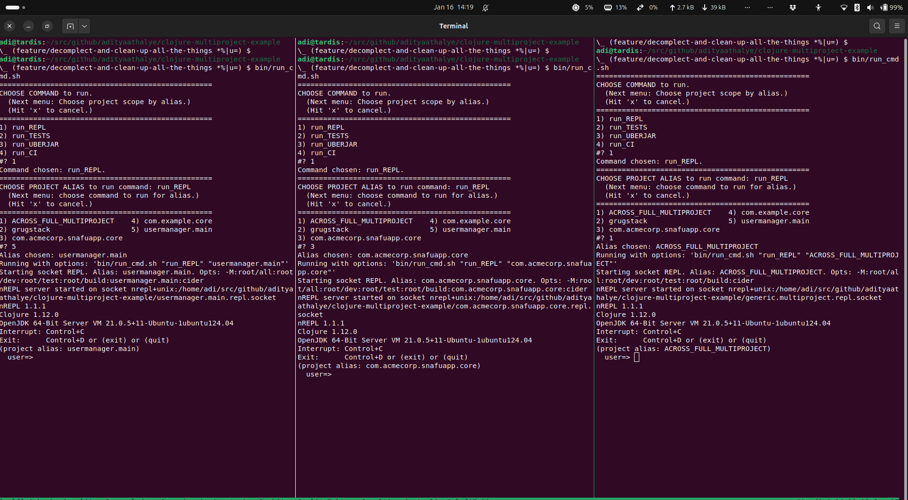

# Clojure Multi-Project Example Layout and Tool Use



**NOTICE: Bespoke Software For My Use**.

However, I hope others find some value in the idea(s) / trick(s)
contained herein. Plus, *"Learn Generously"* is [my
credo](https://www.evalapply.org/), and I hope publishing this
welcomes brain-exchange with kindred spirits.

So... MIT-licensed for great good.

Please mess about and [contribute](#contributing) feedback / critique!
No idea is sacrosanct.

- **Try-out-ers**: Follow [Quick Start](#quick-start) to, well, quick
  start.
- **Rationale-seekers**: [Concept](#concept) and [sundry design notes](sundry-design-notes)
  hopefully explain where I'm trying to go with this.
- **Code readers**, these are the important reference points:
  - The top-level `deps.edn` declares all source code relationships
  - `build/build.clj` and `bin/run_cmd.sh` contain all commands to
    execute against the whole or part of the multiproject
  - **`parts` are *functions***: Mutually independent building blocks
    that we configure and compose into applications. I've made my own
    `grugstack`, but you can vendor in anything of your own.
  - **`projects` are *objects***: Purpose-built applications, having
    whatever architecture they need to have, built using whatever set
    of libraries and/or `parts` they need.
  - *Following multiproject's `:app-alias` naming convention is key
    (haha) to success* (see [MultiProject Conventions](#multiproject-conventions)).

# Quick Start

Try from project root:

- [Requirements](#requirements) must first be satisfied, of course.
- The `bin/run_cmd.sh` Bash helper script builds and runs commands
  documented in [Usage](#usage). (TBD: rewrite as babashka script for
  maximum portability).

```shell
bin/run_cmd.sh # and follow the menu to pick COMMAND and ALIAS

# OR
bin/run_cmd.sh run_TESTS # and follow the menu to pick ALIAS

# OR, directly make it do what you mean...

bin/run_cmd.sh run_TESTS "com.acmecorp.snafuapp.core"

bin/run_cmd.sh run_UBERJAR "com.acmecorp.snafuapp.core"
```

# Concept

As of today, **"multiproject" addresses my own specific
requirements;** viz.

- Indie and Hobby SaaS apps of my own;

- [RAD](https://en.wikipedia.org/wiki/Rapid_application_development "Rapid Application Development")
  for outcomes-driven customers who want long-lived, stable
  software. I'm my own customer! And **I'm available for hire!**

- Benefit from the Clojure ecosystem's creativity, reach, stewardship,
  *and* software stability.

**Professionally**, I want to be able to:

- create, manage, and maintain multiple apps/projects,
- under /a single source tree/ (no diamond dependencies, please),
- crafted with a well curated application stack
- that each application/project can use a la carte
- *and* which I can pry apart cleanly, if needed (e.g. hand over source to a
  customer or buyer (that will be the day!)).

**Architecturally**, I want to retain optionality.

Choosing to focus on *outcomes* means I should retain the option to
use *any* framework or architecture or Clojure dialect, for any type
of application (web, backend, developer tool etc.).

As of this writing, I feel like this is already plausible. I don't see
why any one app managed by "multiproject" cannot itself be a
biff/kit/duct app, or itself follow polylith architecture, or be just
a single babashka script.

**Systematically**, I want /system and workflow/ re-use.

In addition to stack reuse.

Just enough structure to help me manage things, while staying sane,
without building hard dependence on any specific project layout, build
tool, application stack etc.

More stream-of-conscious-y stuff squirreled away under
[sundry design notes](#sundry-design-notes).

# Requirements

## Mandatory

A [working Clojure
installation](https://clojure.org/guides/install_clojure "Clojure
install instructions") (prefer the latest available Clojure).

## Optional

Bash to use the `bin/run_cmd.sh`. I've assumed Bash 5.0+. Bash 4.0+
should be okay too.

## DIY

Non-Linux users may have to fiddle about to make things work right for
them. I use Ubuntu 24.04 LTS on my dev and server boxen. So I haven't
paid attention to any other OS.

# MultiProject Conventions

## Mandatory

**The root `deps.edn` is the lynchpin of control.**

- It defines conventions and data relied upon by everything under the
  multiproject; repl, build, test, ci, local-m2 etc.
- Each project/app must have a minimal `deps.edn` under its project
  root. The app-specific deps file must specify its own library
  dependencies.
- Multiproject commands will ignore any project-specific alias or
  extra path. These may be defined at-will, only for developer
  convenience.

**Top-level alias naming convention does *a lot* of heavy lifting for us.**

  - All project-global information must be described under `:root/`
    aliases, only in the root `deps.edn` file. This helps avoids
    overlap / conflict with system-specific and user-specific
    deps.edn.
  - Each project / application must get its own alias (a keyword),
    only in the root `deps.edn`. The alias data is used by commands
    defined for use within the multiproject.
  - Project alias names *must* map to one and only one project.
  - Project alias name must match the project' main entry point namespace.
    - Build commands rely on the keyword alias when provided
      via. `:app-alias` command line option.
    - The uberjar build procedure relies on our namespacing convention
      to ensure clean separation of build-time classpaths, intermediate
      artifacts, and so forth.
    - Socket REPL management is easier if we name the socket file
      according to the alias.

## Optional

- A multiproject-local `.m2` repository may be useful for dependency
  management / audit reasons, but isn't a hard requirement.
- We many need to help LSP recognise individual apps/projects by
  placing a `.gitignore` under the project root (for completions,
  refactoring, etc.).

# Usage

Use aliases from the root-level deps.edn to run everything from the
root of the source repo. Here "everything" including tests, builds, CI
tasks.

## REPL Development

I prefer to start REPLs at the shell, and connect to them via my code
editor. This lets me independently kill/restart/manage the REPL
process and the Editor process. Sometimes one of them can go into a
bad state. Live REPL state tends to collect orphan objects the longer
they are live. Sometimes I want to force-invalidate some editor
state, which may require killing and cold-starting it. etc...

### Start a REPL at a random port.

This is the most common way to start a REPL. This works just fine for
conventional single-repo single-app style projects.
  ```shell
  clj -M:root/all:root/dev:root/test:cider
  ```
### Start REPL at specific UNIX domain socket.

This is my preferred tactic to trivially share or isolate REPLs from
each other, in a multi-project context. The trick is to name socket
paths along the project directory paths structure. For example:
- To imply a REPL is *shared across the whole multi-project*, create
  the UNIX domain socket at the root of the multi-project repo.

  ```shell
  clj -M:root/all:root/dev:root/test:cider --socket "repl.socket"
  ```
- To imply a REPL is *specific to a project*, create the socket at the
  root of the project directory.

  ```shell
  clj -M:root/all:root/dev:root/test:com.example.core:cider --socket "projects/example_app/repl.socket"

  clj -M:root/all:root/dev:root/test:com.acmecorp.snafuapp:cider --socket "projects/acmecorp/snafuapp/repl.socket"
  ```

## REPL Development with Project Isolation

This trick helps us conveniently access / share code from anywhere in
the multi-project, while also being able to isolate project-specific
REPL state when needed.

Example: Isolating Integrant REPL state per-project, while being able
to access source code from any path in the multi-project.

- We know we can automatically bootstrap custom code and settings into
  the default `user` namespace. This is Clojure's standard bootstrap
  behaviour.
- We know every REPL is an isolated process. So, all bootstrapped
  context is isolated by construction.

Given these guarantees...

- I've placed my "bootstrap" code in `dev/user.clj`, right under the
  root of the multi-project. It contains handy REPL utilities to
  manipulate `system` state (start / stop / restart), as well as spin
  up developer tools like *portal*.
- Thus different REPLs running at independent sockets, are
  bootstrapped using the same `user.clj` code *yet* REPL state is
  maintained independently, in isolated process, by construction.
- *At the same time*, we can use our top-level `deps.edn` settings to
  configure source access for each project-specific alias. With this,
  we can grant access to any permutation of the multi-project
  codebase.

Thus, inert code can be shared, while live state is isolated.

## TEST running

- Test all apps:
  ```shell
  clj -X:root/all:root/test
  ```
  - The trick is to declare all test target directories; viz. root of
    all apps and of grugstack. PLUS, inject grugstack as an extra-deps
    (via :root/all).

- Test only one app:
  - To narrow test target to a single project at a time, we rely on
    the published alias override/merge behaviour of deps.edn.
  - Here do it for SNAFUapp by ACME Corp. By appending its deps.edn
    alias, we narrow test target to only SNAFuapp test dirs. This is
    due to the "win last" override/merge order of aliases
    [defined by Clojure CLI](https://clojure.org/reference/clojure_cli#aliases).
  ```shell
  clj -X:root/all:root/test:com.acmecorp.snafuapp.core
  ```
  - Here we do the same narrowing for `grugstack` itself.
  ```shell
  clj -X:root/all:root/test:grugstack
  ```

## BUILD options

### Full CI

Run full CI sequence for individual apps.

- BUILD default example project specified by alias under this path in
  our deps config -> [:root/build :extra-args :app-alias].
  ```shell
  clj -T:root/build
  ```
  Then check it with...
  ```
  java -jar target/com.example.core/com.example.core-*.jar
  ```
- BUILD project identified by :app-alias
  ```
  clj -T:root/build :app-alias ':com.acmecorp.snafuapp.core'
  ```
  Then check it with...
  ```
  java -jar target/com.acmecorp.snafuapp.core/com.acmecorp.snafuapp.core-*.jar

  # Followed by

  curl localhost:13337
  ```

### UBERJAR only

Package a single app into an uberjar.

Run only "uberjar" part of the CI sequence, for app identified by
`:app-alias`.

```shell
clj -T:root/build uberjar :app-alias ':com.acmecorp.snafuapp.core'
```

Then check it as described above

### TEST only

Run only "test" part of the CI sequence, for apps identified by
`:app-alias`.

```shell
clj -T:root/build test :app-alias ':com.acmecorp.snafuapp.core'
```

## NEW PROJECT addition

We can just use the
[deps-new](https://github.com/seancorfield/deps-new) tool, from the
root directory of the multi-project repo.

Example:

```shell
clojure -Tnew app :name com/acmecorp/fubarapp/core :target-dir projects/acmecorp/fubarapp
```

This produces the usual "application" project layout. We don't really
*need* some of the files under the newly-created project, but it
doesn't hurt us to let them be (README, LICENSE, build.clj, .gitignore
etc.). Tomorrow, if I need to pull the app out of the multi-project,
into a standalone project (say, to hand over to someone), then staying
compatible with the standard app layout should make extraction easier.

```text
$ tree -a projects/acmecorp/fubarapp/
projects/acmecorp/fubarapp/
├── build.clj
├── CHANGELOG.md
├── deps.edn
├── doc
│   └── intro.md
├── .gitignore
├── LICENSE
├── README.md
├── resources
│   └── .keep
├── src
│   └── com
│       └── acmecorp
│           └── fubarapp
│               └── core.clj
└── test
    └── com
        └── acmecorp
            └── fubarapp
                └── core_test.clj
```

# Sundry Project Maintenance
## Code formatting

As of this writing, `cljfmt` drives code formatting convention. Thank
you, yet again, [weavejester](https://github.com/weavejester).

- Install as clj tool aliased as cljfmt:
```shell
clj -Ttools install io.github.weavejester/cljfmt '{:git/tag "0.13.0"}' :as cljfmt
```
- Configure options in `cljfmt.edn` (`:path` being the most important
  for our multi-project).
- Check whole-repo formatting: `clj -Tcljfmt check`
- Fix whole-repo code format: `clj -Tcljfmt fix`
# Sundry Design Notes

Here's my stream of consciousness...

The attempt is to...
- Share a common abstract "system" (which I'm calling `grugstack`),
- across multiple apps, within a single repo (this multi-project example),
- managed with only out-of-the-box tooling (not out-of-the-box thinking).
- Whether the apps are standalone (like `projects/example_app`), or must
  be neatly isolated for my customers (e.g. `projects/acmecorp/snafuapp`).
  - BTW, *do you want to build a niche Micro-SaaS?* For outside
    customers? Inside customers? As your own private force-multiplier?
    *[Hire me!](mailto:adiDELET3ALLCAP1TAL5ANDNUMBER5%40evalapply.org?subject=Build%20us%20a%20Micro%20SaaS%20using%20boringly%20stable%20technology.)*

Conceptually, it is aspirational...
- I was obsessing about web stacks, but now I suspect this bag of
  tricks will generalise to apps made for any arbitrary Clojure /
  ClojureScript runtime; whether web app, desktop, mobile, cli, data
  science etc... And the code for all these diverse apps can be
  managed within a single source repo.
- The *Way* is not Purely Functional /or/ Purely Object Oriented, but
  a "Best of Both" approach, all the way down to code layout.
  - A system of parts (functions) that glue together *à la carte*,
  - via carefully constructed (namespaced, structured) plain Clojure
    data,
  - into any number of runnable apps (open-ended polymorphism) (see
    [credits](#credits)).

Ideally, I want to get away with...
- **the simplest possible project tree layout**, even if it makes code
  and command-line invocations repetitive or verbose. My grug brain
  can easily plod along long paths, as long as they are made painfully
  obvious.
- **the fewest possible bespoke abstractions or terms of art**,
  because making a Domain Specific Language is easy, but keeping it
  sensible is hard.
- **no custom build tooling.** I just want to appropriate the raw
  machinery and public contracts provided by deps.edn, tools.build,
  and Clojure CLI. I've chosen to used in the usual way, via a single
  multi-project-level `build.clj`. Stare at the `build.clj` file and
  the multi-project-level `deps.edn` file side-by-side to see the
  main trick I've used... I figured out a permutation of (alias names
  x grouping of paths x grouping of dependencies x grouping of args
  that must get overridden to narrow context to the last alias).

By design, I want to run tools / start REPLs etc. ***only at the root
of the multi-project***, and use explicit command-line options to
broaden or narrow scope of the command / REPL to the part(s) of the
multi-project that I want to target. This helps me keep a simple
mental model of managing the whole or the part of the multi-project,
that can show up legibly in my shell's history / project logs /
docs etc. (hopefully the [Usage](#usage) examples will make this clear).

# TODO

Lots.

# Contributing

As of now, I am in discussions-only mode... Ping me in the Clojurians
Slack or Zulip or [this thread](https://groups.google.com/g/clojure/c/uroL-ftfrqY)
in the official mailing list.

# Credits

I've consumed way too much web-stack buildin' prior art from across
the Clojure ecosystem. Clojure core, community librarians, builders,
architects, teachers, book authors: the whole lot of you; thank you!

Special mentions to authors making projects and explanations for use
by solo/indie web app builders: biff, duct, zodiac, caveman.

Last but not least, special mention to `polylith`, which lit a key
light bulb in my head... The "Expression Problem" applies to code
layout and application architecture too! Not Functions v/s Objects;
but Functions *and* Objects.

That said, I'm not sure I've "got it" yet. So to take it back to the
top, please [send design notes my way](#)!

# License & Copyright

Copyright (c) 2025 Aditya Athalye.

Distributed under the MIT license.
